# ⚖️ LegalEdge Law Firm

A premium, fully responsive law firm website designed for modern legal practices, corporate firms, and independent attorneys. Built with Next.js, TypeScript, Tailwind CSS, and Framer Motion, the website delivers a professional digital presence with practice areas, attorney profiles, consultation booking, legal resources, and elegant animations.

🔗 **Live Demo:** https://legaledge-law-firm.vercel.app

---

# 📖 About the Project

LegalEdge Law Firm is a premium legal services website created to help law firms establish a trustworthy and professional online presence while making it easy for potential clients to explore legal services and schedule consultations.

The website features comprehensive practice areas, experienced attorney profiles, case achievements, legal resources, consultation booking, client testimonials, and a clean responsive interface optimized for all devices.

This project demonstrates advanced frontend development, responsive UI design, reusable components, modern animations, accessibility, and production-ready web development practices.

---

# ✨ Features

### ⚖️ Practice Areas

- Corporate Law
- Family Law
- Criminal Defense
- Civil Litigation
- Real Estate Law
- Business Law
- Employment Law
- Intellectual Property

### 👨‍⚖️ Expert Attorneys

- Professional lawyer profiles
- Years of experience
- Areas of specialization
- Contact information
- Social media links

### 📅 Consultation Booking

- Online consultation form
- Preferred appointment date
- Practice area selection
- Contact form validation
- Quick consultation request

### 🏆 Case Achievements

- Successful cases
- Years of experience
- Client satisfaction
- Court victories
- Legal statistics

### 💬 Client Testimonials

- Verified client reviews
- Five-star ratings
- Success stories
- Professional testimonials

### 📚 Legal Resources

- Legal articles
- Business compliance guides
- Property law guides
- Family law resources
- Latest legal updates

### 📞 Contact

- Google Maps integration
- Office information
- Working hours
- Phone & Email
- Contact form

### 🎨 User Experience

- Fully responsive
- Mobile-first design
- Sticky navigation
- Smooth animations
- Elegant transitions
- Premium corporate UI

### 🚀 Performance

- SEO optimized
- Fast loading
- Optimized images
- Accessibility focused
- Reusable components

---

# 🛠 Tech Stack

## Frontend

- Next.js
- React
- TypeScript
- Tailwind CSS
- Framer Motion
- Lucide React

## UI & Styling

- Responsive Design
- Modern UI/UX
- CSS Grid
- Flexbox
- Glassmorphism
- Smooth Animations

## Deployment

- Vercel

---

# 📸 Screenshots

### 🏠 Home & About

| Home | About |
|------|-------|
| 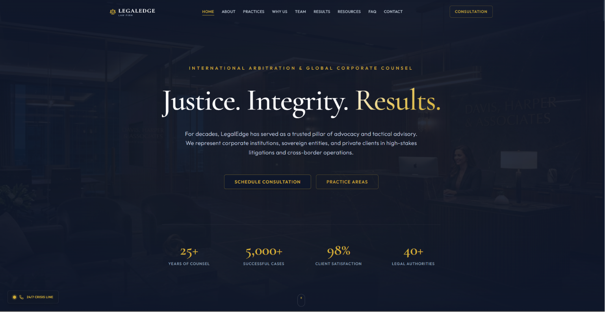 | 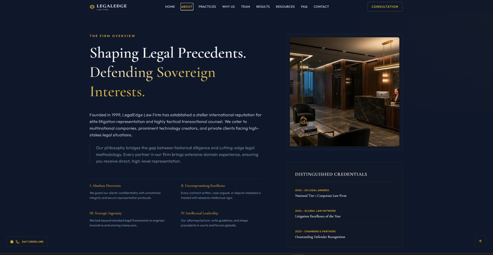 |

---

### ⚖️ Practice Areas & why us

| Practice Areas | why us |
|---------------|-----------|
| 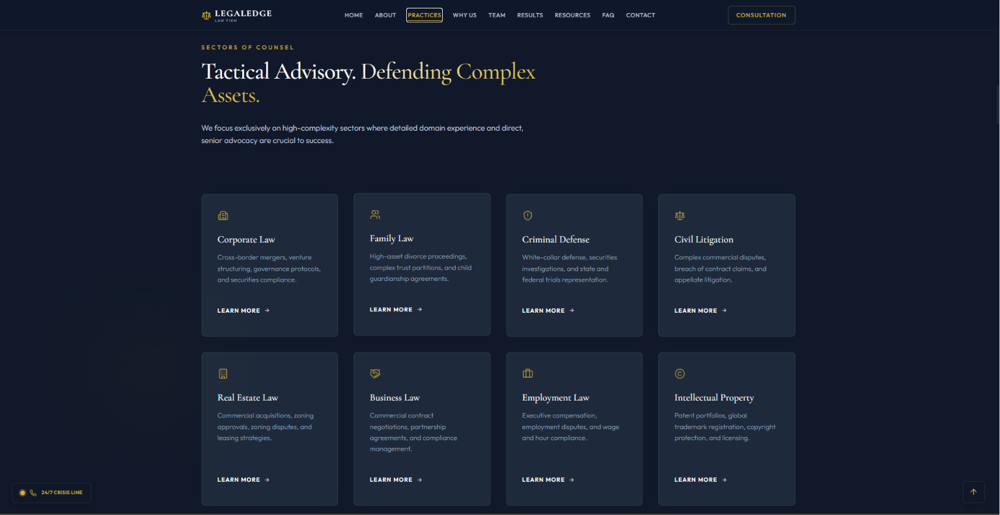 | 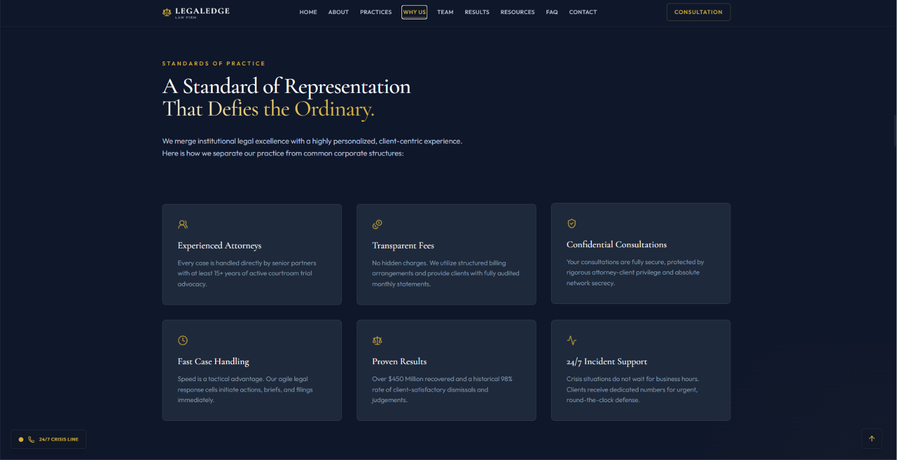 |

---

### 🏆 team & Case Results 

| team | Case Results |
|--------------|--------------|
| 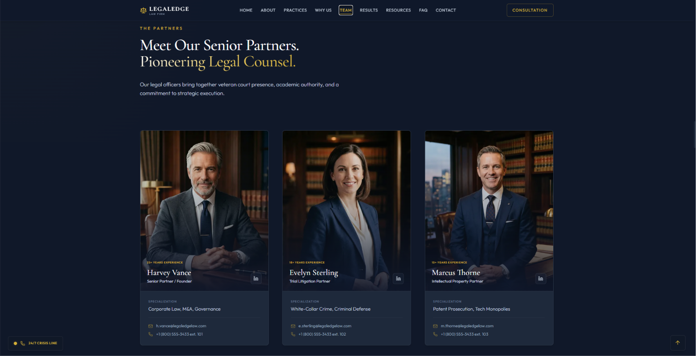 | 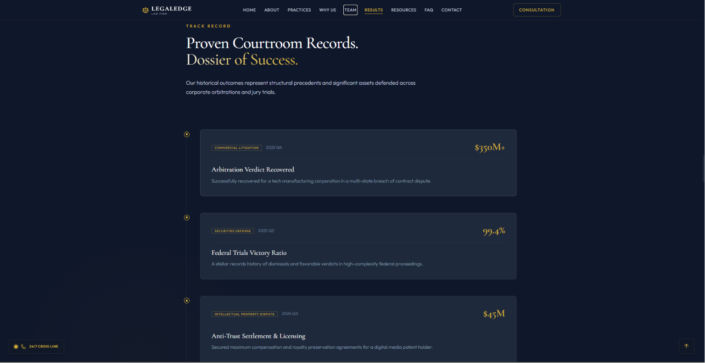 |

---

### 📚  Testimonials & Legal Resources

| Testimonials | Resources |
|-----------------|-----|
| 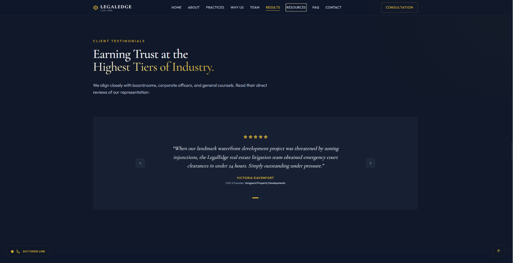 | 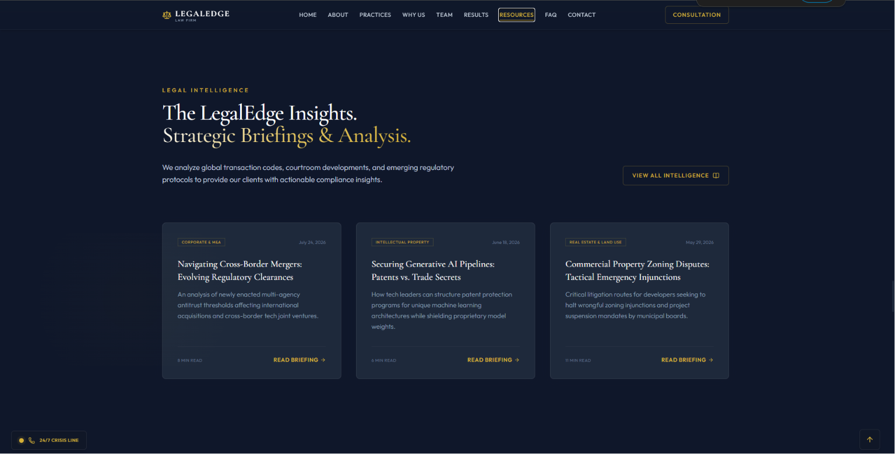 |

---

### 📅 FAQ  & Consultation 

| faq | Consultation |
|------|--------------- |
| 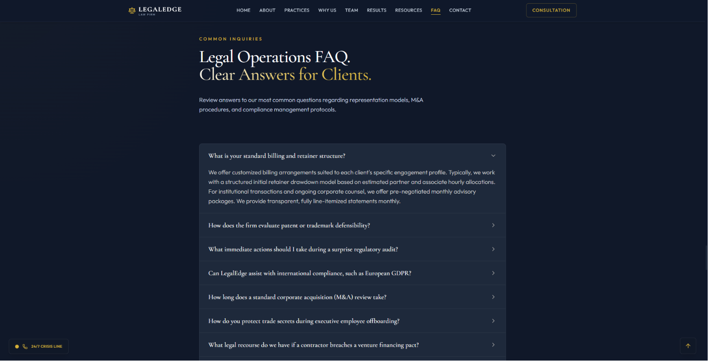 | 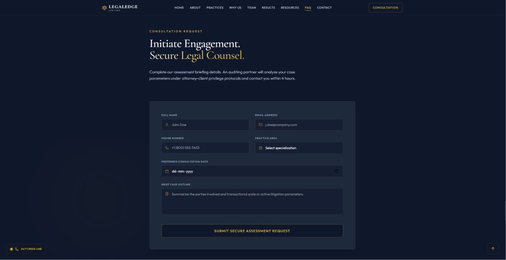 |


###  Contact
| Contact |
|---------|
| 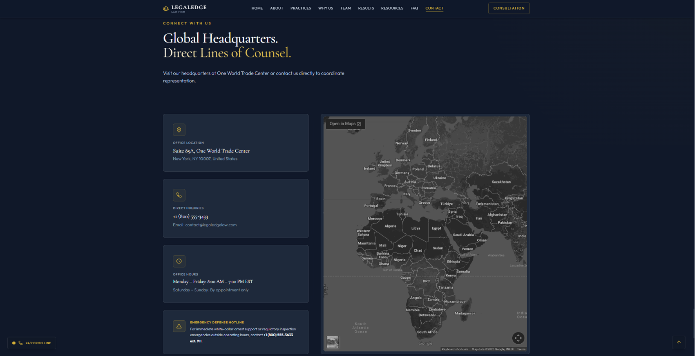 |
---

### 📱 Mobile Preview

<p align="center">
  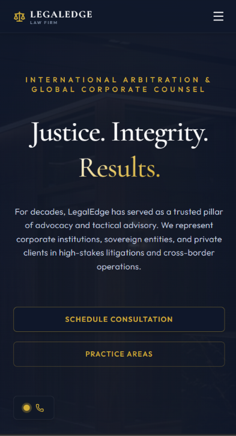
</p>

---

# 📂 Project Structure

```text
legaledge-law-firm
│
├── public
│   ├── images
│   └── icons
│
├── src
│   ├── app
│   ├── components
│   ├── data
│   ├── hooks
│   ├── lib
│   ├── styles
│   └── types
│
├── screenshots
│
├── package.json
├── tsconfig.json
└── README.md
```

---

# ⚙️ Installation

## Clone the repository

```bash
git clone https://github.com/Pulipati-Rahul/legaledge-law-firm.git
```

## Navigate into the project

```bash
cd legaledge-law-firm
```

## Install dependencies

```bash
npm install
```

---

# ▶️ Running the Project

```bash
npm run dev
```

Runs on

```text
http://localhost:3000
```

---

# 🌍 Live Deployment

**Live Website**

https://legaledge-law-firm.vercel.app
---

# 💡 What I Learned

While building this project, I learned:

- Building premium corporate websites
- Next.js App Router
- TypeScript best practices
- Responsive web development
- Modern UI/UX principles
- Component-based architecture
- Framer Motion animations
- Performance optimization
- SEO fundamentals
- Accessibility improvements
- Git & GitHub workflow
- Deployment with Vercel

---

# 🚀 Future Improvements

- Client Portal
- Online Document Upload
- Live Chat Support
- Appointment Dashboard
- Multi-language Support
- Blog Management System
- AI Legal Assistant
- Case Tracking System
- Admin Dashboard
- Email Notifications

---

# 👨‍💻 Author

**Pulipati Rahul**

Full Stack Developer

**GitHub**  
https://github.com/Pulipati-Rahul

**LinkedIn**  
https://www.linkedin.com/in/pulipatirahul

**Portfolio**  
https://pulipatirahul.vercel.app

---

# ⭐ Support

If you found this project helpful, consider giving it a ⭐ on GitHub.

It motivates me to continue building high-quality projects.
